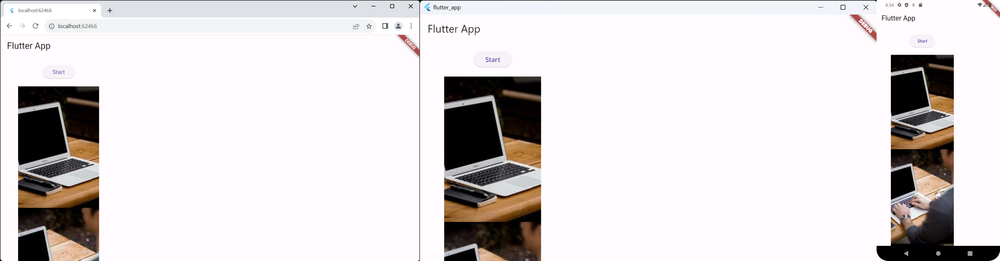

## README

**Beschreibung:**

Diese Flutter-Applikation kann auf Web, Android und Desktop (Windows) ausgeführt werden.

**Voraussetzungen:**

- Flutter SDK installiert
- Für Android:
  - Android Studio oder IntelliJ mit dem Flutter-Plugin
  - Android-Gerät oder Emulator
- Für Web:
  - Google Chrome oder ein anderer Webbrowser
- Für Desktop:
  - Für Windows: Windows 7 SP1 oder höher (64-Bit), PowerShell 5.0 oder höher
**Installation:**

1. Clone das Repository: `git clone https://github.com/abdullah-alhoty/flutter_app.git`
2. In das Projektverzeichnis wechseln: `cd flutter_app`
3. Abhängigkeiten installieren: `flutter pub get`
4. Um potenzielle Probleme zu diagnostizieren: `flutter doctor`
5. Applikation ausführen:

   - Web: `flutter channel beta` dann `flutter run -d chrome`
   - Android: `flutter channel stable` dann `flutter run -d device-id/Emulator` oder nutze einfach Android studio
   - Desktop: Windows: `flutter channel master` then `flutter run -d windows`

**Weitere Informationen:**

- Flutter Dokumentation: [https://flutter.dev/docs](https://flutter.dev/docs)
- Flutter für Web: [https://flutter.dev/web](https://flutter.dev/web)
- Flutter für Desktop: [https://flutter.dev/desktop](https://flutter.dev/desktop)
